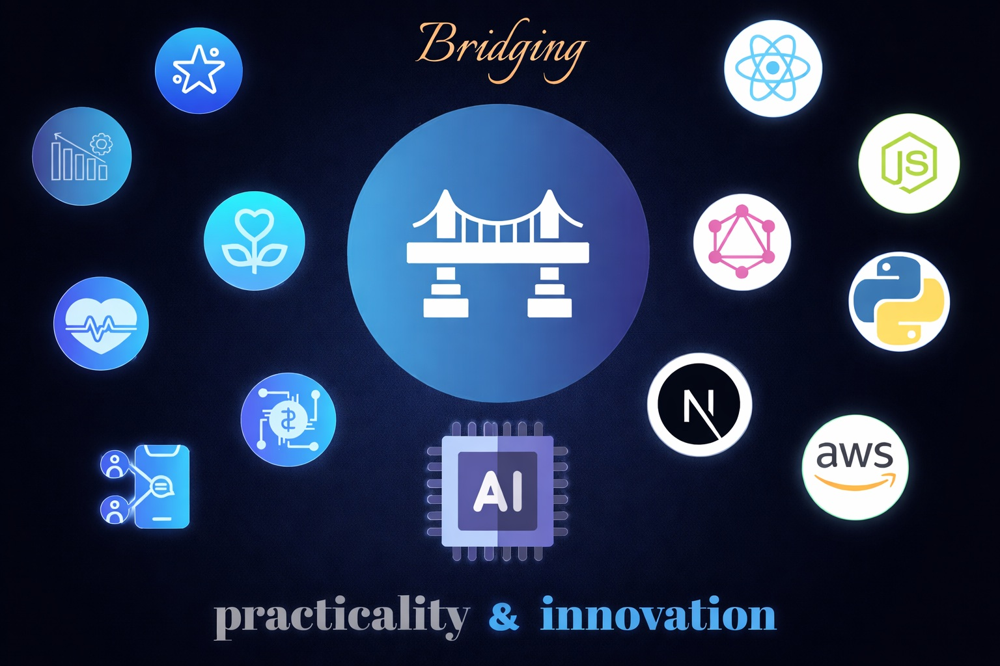

<!-- 

  

 -->

# 💫 About Me
### 
Waison Lee, Well-rounded Software Engineer💻 Developing since 2020 🚀

  
#### 
Hello, I'm Waison—a product-oriented Fullstack Engineer providing comprehensive tech solutions including app development, AI integration and system administration. My commitment to blending innovation with practicality ensures user-friendly results tailored for success. Let's collaborate on making your vision a reality!

 

# 💻 Tech Stack

| **Languages** | **Frameworks** | **Databases** | **Tools** |
|---|---|---|---|
|             |   |      |        	 |

# 📊 GitHub Stats

 
 

# 🕛 Recent Projects

  

# 🌐 Socials

 

# ✍️ Recent Certifications

 

----